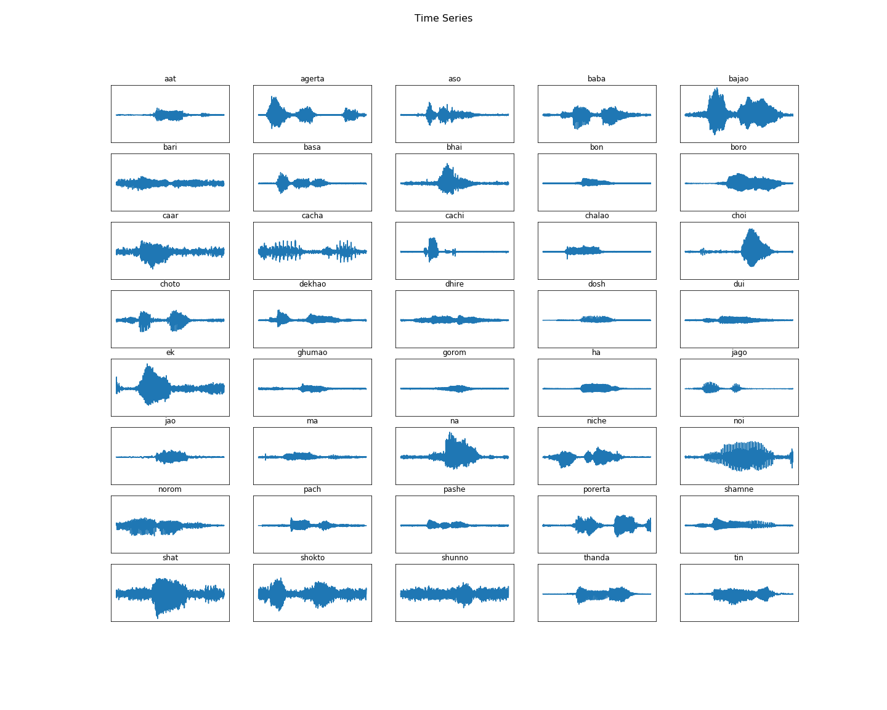
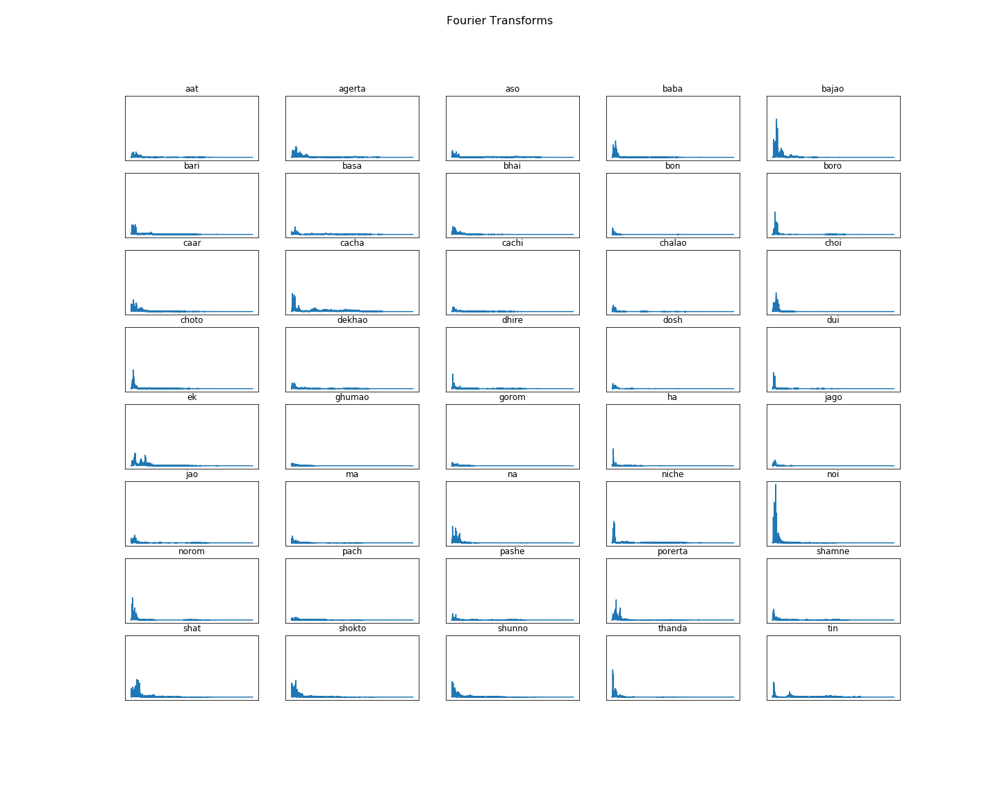
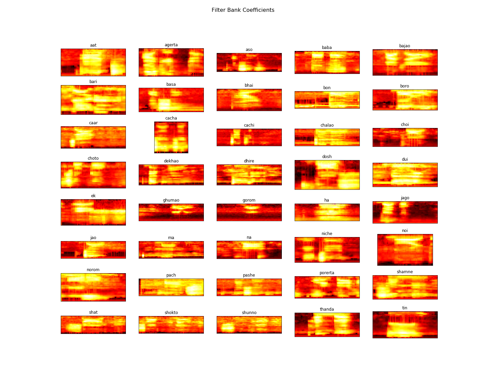
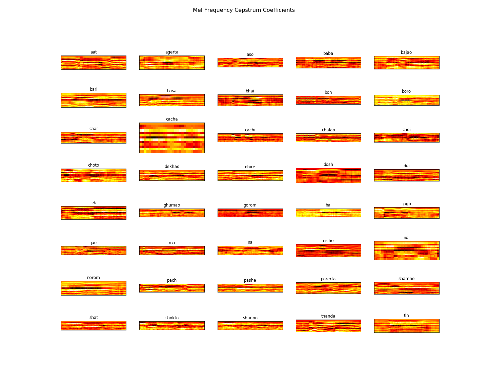

# Bangla-Short-Speech-Recognition

## Installation
Install all dependencies
```python
   $ pip install -r requirements.txt
```

## Audio Short Speech Data Set

| এক | আগেরটা | চাচী | মা | দুই | আসো | চালাও | না |
| ----| ----| ----| ----| ----| ----| ----| ----|
| তিন | বাবা | ছোট | নিচে | চার | বাজাও | দেখাও | নরম |
| পাঁচ | বাড়ি | ধীরে | পাশে | ছয় | বাসা | ঘুমাও | পরেরটা |
| সাত | ভাই | গরম | সামনে | আট | বোন | হ্যা | শক্ত |
| নয় | বড়ো | জাগো | ঠান্ডা | দশ | চাচা | যাও | শূন্য |

<h1 align="center">Time Series Plot</h1>
<p align="center"> 
    <a href="https://github.com/jdchy/Bangla-Short-Speech-Recognition" target="time_series">
        
    </a>
    <br>
</p>

<h1 align="center">Fourier Transforms Plot</h1>
<p align="center"> 
    <a href="https://github.com/jdchy/Bangla-Short-Speech-Recognition" target="Fourier_transforms">
        
    </a>
    <br>
</p>

<h1 align="center">Filter Bank Coefficients Plot</h1>
<p align="center"> 
    <a href="https://github.com/jdchy/Bangla-Short-Speech-Recognition" target="Filter_bank_coefficients">
        
    </a>
    <br>
</p>

<h1 align="center">Mel Frequency Cepstrum Coefficients Plot</h1>
<p align="center"> 
    <a href="https://github.com/jdchy/Bangla-Short-Speech-Recognition" target="mfcc">
        
    </a>
    <br>
</p>
